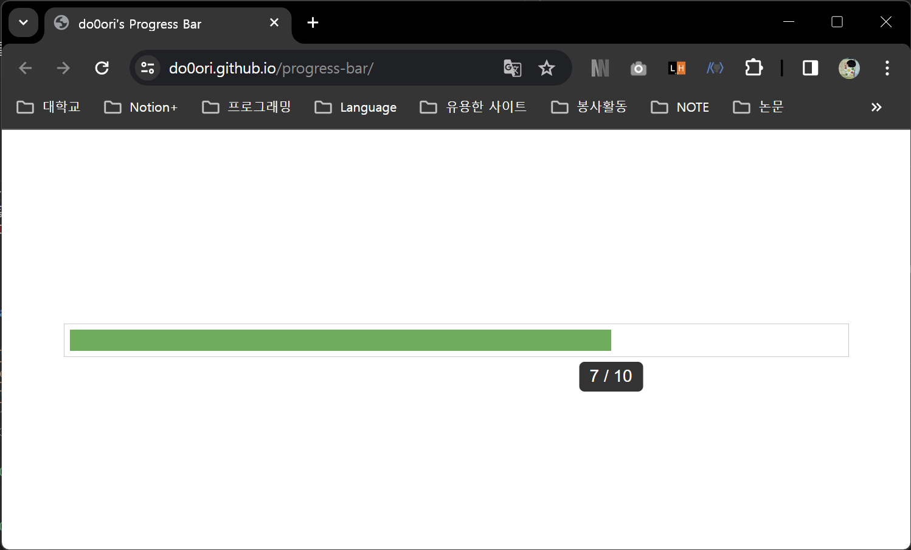

# ✅Progress Bar
간단한 progress bar입니다.

## Motivation Behind the Project
notion에 강의를 들으며 정리를 하는데 강의 진행률을 시각화하고 싶어서 notion progress bar widget에 대해 열심히 찾아봤습니다. 하지만 notion 자체로는 [table view database의 수식을 이용하는 방법](https://www.notion.so/do0ori/Progress-Bar-b908b8a1e4804ca5a6ababb313b216bc)이 최선이었고 notion의 link embed를 활용한 third-party widget도 존재하지 않았습니다. 여러모로 만족스럽지 않아 직접 만들게 되었습니다.

## Usage
🔗[Progress Bar 바로가기](https://do0ori.github.io/progress-bar/)

| progress bar 클릭 위치 | 동작 |
| --- | --- |
| 왼쪽 | -1 |
| 오른쪽 | +1 |
| 가운데 | total 숫자 설정 |

## Key Features
- 공간 차지 적습니다.
- 필요한 기능만 넣었습니다.
- 이식성이 높습니다.
- LocalStorage에 데이터를 저장하여 domain별로 반영구적으로 unique하게 사용 가능합니다.

## Technology Stack

    
    
    

## Contributions
버그를 발견하거나 새로운 기능을 제안은 언제나 환영입니다! [이슈](https://github.com/do0ori/progress-bar/issues)를 작성해주세요.